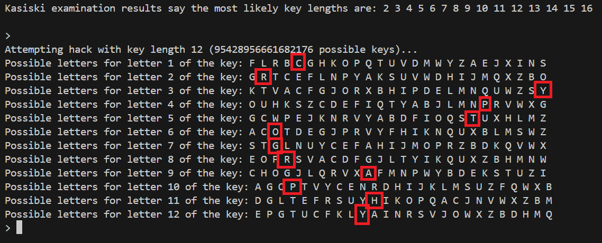

# Завдання 1: Шифр Віженера

## Рівень 1: Результати шифрування та дешифрування з ключем "CRYPTOGRAPHY"

- 01_vigenere.py Зашифрований текст: 
Vyc tfzzsi gu rwx iiepamt mu pkruipdwc iawtxs. Rq ptosgc pyr rls quecthj kft oxkiha kj pkh'j ppk. Rwx iiiipa zq as nhd ace ikotjlpac zlih geoioct kpgbki dy c ltp srttygcc wbg zmeycujgdg uw qlywkgunz khxueu. Ias yivocuk, tg kht jqnchm, wogt qw rkwzzcxzk zq t sfdt mh yjmchzovyyryw. Hnfst ujf ubbj uvsw dcpgwtxs pl scpnhowua rjzlvl gie jmtisem cztwvsv ztbbm cwhpozlv. Zyih gu y yoact. Rjfqt knf uplf zttizzfjs ovycbbmj xu dvyjmwlll afkeeh oxv ioc tsamwbrttk. Wmg hnvst rjvpt wy hdwc. Rwxm rrt rjv tesik iv yymb pkruipdwc iawtxs tcce dgze Bthsvp. Mvkie pq em liiy iogpx pl g mdyyn mg ot ibtmtrj ucub. Imqbq tfk wtsj npxmhke, vp sysem nrxarge. Mvgk xz ccj. Hnv cplgkctghn-cturwiw wwycizl qw gxorzsb gu rwx xrgt mh Apewhrn zcgzlv voj ddl wyrx oe p enrqh. Zye ugpvrtxbzy-rllvlpn rojlxrc fd Kcsrnipakjk bg kht pcxc ht Taapzce chh jetpli fxl unn myev xg g gahqu. Ias doghj cgux uw bhl wmgfg gaga qw ias juqqcek bthzvr vd kft oxkiha, ssi hnv bvpccgir uw pyr tmclwyks pl kft dkiftjr lqt cl ac gogcgysik blbklk. Bu agaguk sxgoieh rq nghjk acfrjzlv. Kmec rjzlvl zyai ytv ikik cpu dv ekcbvd. Lq ygmwyk whq vrwbqgc hfkrrrwbsy. Pu gkfxvor sntnckfn wt ac ytkghm oj pu wenpkrueaqsc dycgsxzsb mh qirzk. Cv cirxlh zs ltgi bhfhzd. Rjv pkhojt jyp cmifkjs ltgiwiawtx. Afqlewm ged sypxspzs rrt rq rwx gitxzr zlhmfadecaq fd tb rri. Xzat otu kppvlc tfk td rjv pkhojt tyvvpxtzy fdy ce pkh. Fgvk kft duzni mh txxk ff mmtd, mvk tnwc fd tzr twl cirh wy twl cir ht kht kwjgrbot. Uymo rwx vfica qw kbsc ou dgvjxgu, twl ctrdk'y cghdv gh hnv ifng. Pez rri gu yi ctte zstwyrx ged zwosma. Zyohl yym zc seclyvy ias jugmyev sh yf pa vycxk vvrxs. Kfdls nhd pgrb mvk sntzqc sh yf pa vycxk vvrxs. Zr bg kht qrvaithui, hlf ldm rzft, vyyi oxk glyncw fwxiogz. Ugkxfyztn mh mebbofn hzqlr t cfrz mh ygm yyolz vyyi hnv lvpm gh bkn, jmogjtq, miihj. Uwxb trxagej sbggxrtl vyc tfzzsi gu gc oitogk yzrw vodstsd. Ut qge uvpiztt o dac dqi btyoeg h wjcunz khxue rq ectx pz jv shsy nda cukxks zt. Rjv dgze emjsuv uhf dazpli y ngkcehz vygcz oj ioyv mcx gumxycu gi wtkeczcnp. Tzr aga kj fnwzv jzcnvqh.

- 01_vigenere.py Розшифрований текст: 
The artist is the creator of beautiful things. To reveal art and conceal the artist is art's aim. The critic is he who can translate into another manner or a new material his impression of beautiful things. The highest, as the lowest, form of criticism is a mode of autobiography. Those who find ugly meanings in beautiful things are corrupt without being charming. This is a fault. Those who find beautiful meanings in beautiful things are the cultivated. For these there is hope. They are the elect to whom beautiful things mean only Beauty. There is no such thing as a moral or an immoral book. Books are well written, or badly written. That is all. The nineteenth-century dislike of realism is the rage of Caliban seeing his own face in a glass. The nineteenth-century dislike of Romanticism is the rage of Caliban not seeing his own face in a glass. The moral life of man forms part of the subject matter of the artist, but the morality of art consists in the perfect use of an imperfect medium. No artist desires to prove anything. Even things that are true can be proved. No artist has ethical sympathies. An ethical sympathy in an artist is an unpardonable mannerism of style. No artist is ever morbid. The artist can express everything. Thought and language are to the artist instruments of an art. Vice and virtue are to the artist materials for an art. From the point of view of form, the type of all the arts is the art of the musician. From the point of view of feeling, the actor's craft is the type. All art is at once surface and symbol. Those who go beneath the surface do so at their peril. Those who read the symbol do so at their peril. It is the spectator, and not life, that art really mirrors. Diversity of opinion about a work of art shows that the work is new, complex, vital. When critics disagree the artist is in accord with himself. We can forgive a man for making a useful thing as long as he does not admire it. The only excuse for making a useless thing is that one admires it intensely. All art is quite useless.

## Level 2: using Kasiski method to decrypt

Як бачимо, метод Казіскі пропонує як один із варіантів довжину нашого ключа, але частотний аналіз не допомагає скоротити кількість варіантів, оскільки для знаходження всіх літер ключа потрібно перевірити всі 26 літер алфавіту. Ми можемо задовільнитись і більш раннім результатом з 11 варіантів на літеру ключа, але для повного розшифрування знадобиться людський фактор

Висновок: Навіть при достатньо великому повідомленні, що шифрується та великій кількості даних для частотного аналізу, якщо ключ достатньо великий, необхідний час на розшифрування збільшується у геометричній прогресії.

# Завдання 2: Шифр перестановки

## Рівень 1: Результати шифрування та дешифрування з ключем "SECRET"

### Процес шифрування:
- букви ключа використовуються для позначення стовпців, усі літери, знаки і інші символи поточного тексту записуються послідовно в рядки під літерами ключа. Далі шифрований текст формується з послідовно поєднанного тексту, що утворюється у стовпці, один за одним відповідно послідовності ключа.
- Розшифрування повністю в оберненому порядку.

Результат

- 02_transposition.py Зашифрований текст: 
Ttscreunoa o ri'.c  an areama sou s s o ot mfbphhd n iharwtgmTsuhhdtmgbfir v hhs. hcweunayte cnalnrooe e  eaahehusolsrfbei ilTntti mi a a gocas  o  o ct r hao s e fmciosioehEhtrebvos apselanriuo rfea ebhineenoan oa u  Vntehitsa. of re lasa unmpowe,asthe snramTw t cstp  eeostp  podltrlr sfiowfsthkem . cattscwi.ag oiu  nhsa hys getitasnllitlhi r alg lanttss riwnsin r alisftt.httwffiio ihoo mgbfirri  ih loo ieseunecaFee  aethalgn yrnhg   akk wnbwntlet-rlfi a aisfnahehusoastgCns we .mlffpfstettbelfcttru ptu tr  ivihe ee tela.t t tsnnmi .riries srgunga rimoaidu ese n ti om o r rts. of e c  e.a cfnbhhbhseoheTwa loheIter ihtlrDi ouo hhe wpv csghi cim nimrnstage die em lhs d ty seeesteou sr nchi  Tish lnom nt mi ih i,heo csdaoys ueseuneutbcniats bfa alg utosrhTr  ou s B.eo  moil.swr,ar. l ecyi stgCnn a set-rlfnmhea ehn g oi oa u rhiu i oshfsae ma epanena c da t t hshai paass ts d tesy.gdurttnefrc et trf Fhnvf,tftttthi ti olttci  raeadoooe u  erhhds  erthc,nfa yoitontraoa i,liWr resiotsW va gehs  nmt e aaei omie.a  s thaftt.eadeesaaht otattaoeehpobfiTg esrci eug.efga alg phehgs .efeuniu stlereeoheetmtt oe   taorm   ei di i.nee krmhea gocas ecyi t e lnei ilTrfmrrtbm estmtan eeenrm.rdsrngngttap.rhhshAiyynsaabnmtNi m.a x t h aehisn tev oa ioareti  y hsh ecFhnvfihorstAtt c ls ntrdaiioo ydaii et oetr rvyp  krwtws ethide tnrheefenm fi adoi.oxfk sntnitn rqusa et ih vr a trieih rtohnrwrirneunhha tmrsa tr  ilniu sctoia. f  ialintt htd   pe lo ihmnaTishsr mbBaltoltTs inndee e ls we .nee kRii oioisfnahaeamthjao t oyrsi c  fe te oy. s rnr taiyincm  tnrln yoseo rcpehTtlg estta. ia rmarro  eftpae eo ireti nera yl  ses.egehfotrls tmotrli aat, emse iaa ts o cxaetiea  d l o  aaunlsotr ncoiusgher sAtus.ri obfiTetcla tm cecae en  ise algeesl, im ooaTwnyintt o unr iaTwnu n ihaei.ttieyte bfieluhsui aaooorltryth Tntti ai oiehn g inndeocsrfbtn a sel ns eetfa,tr tinptoiedNistvt t au oNiscme apia  deeol tvrTtarvih aet trsn arrttal tmpowohel i fmao  efg 'ftpliou y  oaea   .erhb   .sstn  aai.ronb o  trno,lnis ria hfcrafk lgo e eTlurns  a eiel ie

- 02_transposition.py Розшифрований текст: 
The artist is the creator of beautiful things. To reveal art and conceal the artist is art's aim. The critic is he who can translate into another manner or a new material his impression of beautiful things. The highest, as the lowest, form of criticism is a mode of autobiography. Those who find ugly meanings in beautiful things are corrupt without being charming. This is a fault. Those who find beautiful meanings in beautiful things are the cultivated. For these there is hope. They are the elect to whom beautiful things mean only Beauty. There is no such thing as a moral or an immoral book. Books are well written, or badly written. That is all. The nineteenth-century dislike of realism is the rage of Caliban seeing his own face in a glass. The nineteenth-century dislike of Romanticism is the rage of Caliban not seeing his own face in a glass. The moral life of man forms part of the subject matter of the artist, but the morality of art consists in the perfect use of an imperfect medium. No artist desires to prove anything. Even things that are true can be proved. No artist has ethical sympathies. An ethical sympathy in an artist is an unpardonable mannerism of style. No artist is ever morbid. The artist can express everything. Thought and language are to the artist instruments of an art. Vice and virtue are to the artist materials for an art. From the point of view of form, the type of all the arts is the art of the musician. From the point of view of feeling, the actor's craft is the type. All art is at once surface and symbol. Those who go beneath the surface do so at their peril. Those who read the symbol do so at their peril. It is the spectator, and not life, that art really mirrors. Diversity of opinion about a work of art shows that the work is new, complex, vital. When critics disagree the artist is in accord with himself. We can forgive a man for making a useful thing as long as he does not admire it. The only excuse for making a useless thing is that one admires it intensely. All art is quite useless.

## Рівень 2: Шифр подвійної перестановки з ключами "SECRET" та "CRYPTO" та зміною шифрування у другому раунді з колонок на рядки

### Процес шифрування:
- Після першого рівня шифрування, букви нового ключа використовуються для позначення рядків, усі літери, знаки і інші символи поточного тексту записуються послідовно в стовпці навпроти літер ключа. Далі шифрований текст формується з послідовно поєднанного тексту, що утворюється у рядку, один за одним відповідно послідовності ключа.
- Розшифрування повністю в оберненому порядку.

Результат

- 02_transposition.py Подвійно зашифрований текст: 
Tu  rss hhmdihwtl aoenig ca shoeuann h  ueemce tft.sg htligtwrfto rhie ar neishtwfef rht nisaasi . aho ttoeccmg s tr  nieaeuaauT olaetare ohoep tha ytcrvtttaoe cyti t   o aaaaeirg h.iee t ieeaillrs mnasnm. ivo hnr nia rk ee okiu  eoihr ui t lnsaTdl.Rohh   .rityrttartoi ehsrtetxa uru .flceeemwtrnht ual  eicnlertitN   aastmemfpyar. o lirgT etnr eo mdaTtrseenehlit ootofitslo e  ioln, Tse rih c nyil  sn tw mr ec lnabt fugeftcp eetmrr ie r c hhlelu siree se  lthoostt trs .rcg lagais ac asd.t ffticeer ,or,rsgnam fdhthTc.aeeureoa   as nTtte.gphstahs a  vsctoiovre efi tsiaihrhs  ait oarlsesniiajoct  nnoclt op  ysf l, sa on ssriaen s n  uaibhatTahns  t os iadtrentplagl  hsantnaaol lsoiaauof rsm .u r es tac   mor a eeoVtfamaswtoplokcwohstirlssatfigilsaaghkw-ansC pttt  l iigrd o o cbeorrowgmn mdeonTn   yebsao   s.yCsf   uhmn tis gne ,t ia henialeWemaistettpgielhf eteoeik  terbmern.AaN  noryeft roieywttfi.snah hnnaais.a   T t e eiseay estcrspgar ainl.oti i e  lngAiT c aloyoi eefsorninnranftitaspevvt ao o i  bsabri f ua ca'nm  bnwugv nco hrii a rsceeanrbnans spsn psorweaiis at a il.fhb oeFengknr aon.fbtuieat euiunmrf fhTh D ph sd  euciomicsuc ls Bmw ineneou faed   tdetFtho duhrftois htee te ao  fggesem ri.rge ifmtedgriaixa ae ciAld  tpthne on   t re  lc lhpiimoi we faor   amlee .m ere etm eaotd scht eta l,oi aniyiuoyt  df saievucieri alwi 'oo  ti nshker ir . asop thb hanoeufl aso  ihbprfho taraotrt td fmt.uagslanrnihiof ouet   tlahasmser ve.s.snm   t ensweiihvintilte hsmi,s nnbgro.orl ntmhi is nahpteuf hfil o dtaoaWivs i.t.soobeeg sutot m nmoce m ansthyb  et thFhtsayer wirnaxtrevrrwuttntfitehsblnee onm sfori nohe ae er groama i aooeuotmeig anuT .teiottogebs ,ndt maoThtr o  fua. n.oo f  neeeoca  thighfhcyaeasbTm   heoEvsieiaue.e wha  plss ta  enhlti stioii nehy wlfies ltluti tnr goetose.beaIh h  iaehyssih  hdueif huei, s -hn r aea sassrrtnt tro sh n roa e aheatefsuap nlht  dehcy irenrrthynmtheiishot idt  sdhmdfnqtritrnmrio nd mhBtn  kiattieyny   Tsirfetaseltas celatirsbc  seiTtnwitel rhii oteetpN oe lt rrthfet ee  r ,rclesi

- 02_transposition.py Розшифрований текст перший рівень: 
Ttscreunoa o ri'.c  an areama sou s s o ot mfbphhd n iharwtgmTsuhhdtmgbfir v hhs. hcweunayte cnalnrooe e  eaahehusolsrfbei ilTntti mi a a gocas  o  o ct r hao s e fmciosioehEhtrebvos apselanriuo rfea ebhineenoan oa u  Vntehitsa. of re lasa unmpowe,asthe snramTw t cstp  eeostp  podltrlr sfiowfsthkem . cattscwi.ag oiu  nhsa hys getitasnllitlhi r alg lanttss riwnsin r alisftt.httwffiio ihoo mgbfirri  ih loo ieseunecaFee  aethalgn yrnhg   akk wnbwntlet-rlfi a aisfnahehusoastgCns we .mlffpfstettbelfcttru ptu tr  ivihe ee tela.t t tsnnmi .riries srgunga rimoaidu ese n ti om o r rts. of e c  e.a cfnbhhbhseoheTwa loheIter ihtlrDi ouo hhe wpv csghi cim nimrnstage die em lhs d ty seeesteou sr nchi  Tish lnom nt mi ih i,heo csdaoys ueseuneutbcniats bfa alg utosrhTr  ou s B.eo  moil.swr,ar. l ecyi stgCnn a set-rlfnmhea ehn g oi oa u rhiu i oshfsae ma epanena c da t t hshai paass ts d tesy.gdurttnefrc et trf Fhnvf,tftttthi ti olttci  raeadoooe u  erhhds  erthc,nfa yoitontraoa i,liWr resiotsW va gehs  nmt e aaei omie.a  s thaftt.eadeesaaht otattaoeehpobfiTg esrci eug.efga alg phehgs .efeuniu stlereeoheetmtt oe   taorm   ei di i.nee krmhea gocas ecyi t e lnei ilTrfmrrtbm estmtan eeenrm.rdsrngngttap.rhhshAiyynsaabnmtNi m.a x t h aehisn tev oa ioareti  y hsh ecFhnvfihorstAtt c ls ntrdaiioo ydaii et oetr rvyp  krwtws ethide tnrheefenm fi adoi.oxfk sntnitn rqusa et ih vr a trieih rtohnrwrirneunhha tmrsa tr  ilniu sctoia. f  ialintt htd   pe lo ihmnaTishsr mbBaltoltTs inndee e ls we .nee kRii oioisfnahaeamthjao t oyrsi c  fe te oy. s rnr taiyincm  tnrln yoseo rcpehTtlg estta. ia rmarro  eftpae eo ireti nera yl  ses.egehfotrls tmotrli aat, emse iaa ts o cxaetiea  d l o  aaunlsotr ncoiusgher sAtus.ri obfiTetcla tm cecae en  ise algeesl, im ooaTwnyintt o unr iaTwnu n ihaei.ttieyte bfieluhsui aaooorltryth Tntti ai oiehn g inndeocsrfbtn a sel ns eetfa,tr tinptoiedNistvt t au oNiscme apia  deeol tvrTtarvih aet trsn arrttal tmpowohel i fmao  efg 'ftpliou y  oaea   .erhb   .sstn  aai.ronb o  trno,lnis ria hfcrafk lgo e eTlurns  a eiel ie

- 02_transposition.py Розшифрований текст другий рівень: 
The artist is the creator of beautiful things. To reveal art and conceal the artist is art's aim. The critic is he who can translate into another manner or a new material his impression of beautiful things. The highest, as the lowest, form of criticism is a mode of autobiography. Those who find ugly meanings in beautiful things are corrupt without being charming. This is a fault. Those who find beautiful meanings in beautiful things are the cultivated. For these there is hope. They are the elect to whom beautiful things mean only Beauty. There is no such thing as a moral or an immoral book. Books are well written, or badly written. That is all. The nineteenth-century dislike of realism is the rage of Caliban seeing his own face in a glass. The nineteenth-century dislike of Romanticism is the rage of Caliban not seeing his own face in a glass. The moral life of man forms part of the subject matter of the artist, but the morality of art consists in the perfect use of an imperfect medium. No artist desires to prove anything. Even things that are true can be proved. No artist has ethical sympathies. An ethical sympathy in an artist is an unpardonable mannerism of style. No artist is ever morbid. The artist can express everything. Thought and language are to the artist instruments of an art. Vice and virtue are to the artist materials for an art. From the point of view of form, the type of all the arts is the art of the musician. From the point of view of feeling, the actor's craft is the type. All art is at once surface and symbol. Those who go beneath the surface do so at their peril. Those who read the symbol do so at their peril. It is the spectator, and not life, that art really mirrors. Diversity of opinion about a work of art shows that the work is new, complex, vital. When critics disagree the artist is in accord with himself. We can forgive a man for making a useful thing as long as he does not admire it. The only excuse for making a useless thing is that one admires it intensely. All art is quite useless.

Як бачимо, розшифрований текст першого рівня після подвійного шифрування повністю співпадає із зашифрованим текстом з першого рівня

# Завдання 3: Матричний шифр

## Рівень 1: Результати шифрування та дешифрування з ключем "MATRIX"

Оскільки роз’яснень в описі ДЗ не було, який саме метод і яким чином треба використовувати, реалізація вільна. Це адаптація методу матриці Полібія, що не має обмежень по кількості рядків (оригінальна матриця 5х5)

Створюємо матрицю, де спочатку йдуть літери нашого ключ (без повторів), а потім усі літери, яких не вистачає для повного набору алфавіту: 
['M', 'A', 'T', 'R', 'I'] 
['X', 'B', 'C', 'D', 'E'] 
['F', 'G', 'H', 'J', 'K'] 
['L', 'N', 'O', 'P', 'Q'] 
['S', 'U', 'V', 'W', 'Y'] 
['Z'] 

Результат

- 03_table_matrix.py Зашифрований текст: 
Cok bdcezc ez cok hdkbcvd vl gkbacelas coeunz. Cv dktkbs bdc buj hvuhkbs cok bdcezc ez bdc'z bex. Cok hdeceh ez ok rov hbu cdbuzsbck eucv buvcokd xbuukd vd b ukr xbckdebs oez exwdkzzevu vl gkbacelas coeunz. Cok oenokzc, bz cok svrkzc, lvdx vl hdecehezx ez b xvjk vl bacvgevndbwoi. Covzk rov leuj ansi xkbueunz eu gkbacelas coeunz bdk hvddawc recovac gkeun hobdxeun. Coez ez b lbasc. Covzk rov leuj gkbacelas xkbueunz eu gkbacelas coeunz bdk cok hascetbckj. Lvd cokzk cokdk ez ovwk. Coki bdk cok kskhc cv rovx gkbacelas coeunz xkbu vusi Gkbaci. Cokdk ez uv zaho coeun bz b xvdbs vd bu exxvdbs gvvq. Gvvqz bdk rkss rdeccku, vd gbjsi rdeccku. Cobc ez bss. Cok ueukckkuco-hkucadi jezseqk vl dkbsezx ez cok dbnk vl Hbsegbu zkkeun oez vru lbhk eu b nsbzz. Cok ueukckkuco-hkucadi jezseqk vl Dvxbucehezx ez cok dbnk vl Hbsegbu uvc zkkeun oez vru lbhk eu b nsbzz. Cok xvdbs selk vl xbu lvdxz wbdc vl cok zagpkhc xbcckd vl cok bdcezc, gac cok xvdbseci vl bdc hvuzezcz eu cok wkdlkhc azk vl bu exwkdlkhc xkjeax. Uv bdcezc jkzedkz cv wdvtk buicoeun. Ktku coeunz cobc bdk cdak hbu gk wdvtkj. Uv bdcezc obz kcoehbs zixwbcoekz. Bu kcoehbs zixwbcoi eu bu bdcezc ez bu auwbdjvubgsk xbuukdezx vl zcisk. Uv bdcezc ez ktkd xvdgej. Cok bdcezc hbu kfwdkzz ktkdicoeun. Covanoc buj sbunabnk bdk cv cok bdcezc euzcdaxkucz vl bu bdc. Tehk buj tedcak bdk cv cok bdcezc xbckdebsz lvd bu bdc. Ldvx cok wveuc vl tekr vl lvdx, cok ciwk vl bss cok bdcz ez cok bdc vl cok xazehebu. Ldvx cok wveuc vl tekr vl lkkseun, cok bhcvd'z hdblc ez cok ciwk. Bss bdc ez bc vuhk zadlbhk buj zixgvs. Covzk rov nv gkukbco cok zadlbhk jv zv bc coked wkdes. Covzk rov dkbj cok zixgvs jv zv bc coked wkdes. Ec ez cok zwkhcbcvd, buj uvc selk, cobc bdc dkbssi xeddvdz. Jetkdzeci vl vweuevu bgvac b rvdq vl bdc zovrz cobc cok rvdq ez ukr, hvxwskf, tecbs. Roku hdecehz jezbndkk cok bdcezc ez eu bhhvdj reco oexzksl. Rk hbu lvdnetk b xbu lvd xbqeun b azklas coeun bz svun bz ok jvkz uvc bjxedk ec. Cok vusi kfhazk lvd xbqeun b azkskzz coeun ez cobc vuk bjxedkz ec euckuzksi. Bss bdc ez yaeck azkskzz.

- 03_table_matrix.py Розшифрований текст: 
The artist is the creator of beautiful things. To reveal art and conceal the artist is art's aim. The critic is he who can translate into another manner or a new material his impression of beautiful things. The highest, as the lowest, form of criticism is a mode of autobiography. Those who find ugly meanings in beautiful things are corrupt without being charming. This is a fault. Those who find beautiful meanings in beautiful things are the cultivated. For these there is hope. They are the elect to whom beautiful things mean only Beauty. There is no such thing as a moral or an immoral book. Books are well written, or badly written. That is all. The nineteenth-century dislike of realism is the rage of Caliban seeing his own face in a glass. The nineteenth-century dislike of Romanticism is the rage of Caliban not seeing his own face in a glass. The moral life of man forms part of the subject matter of the artist, but the morality of art consists in the perfect use of an imperfect medium. No artist desires to prove anything. Even things that are true can be proved. No artist has ethical sympathies. An ethical sympathy in an artist is an unpardonable mannerism of style. No artist is ever morbid. The artist can express everything. Thought and language are to the artist instruments of an art. Vice and virtue are to the artist materials for an art. From the point of view of form, the type of all the arts is the art of the musician. From the point of view of feeling, the actor's craft is the type. All art is at once surface and symbol. Those who go beneath the surface do so at their peril. Those who read the symbol do so at their peril. It is the spectator, and not life, that art really mirrors. Diversity of opinion about a work of art shows that the work is new, complex, vital. When critics disagree the artist is in accord with himself. We can forgive a man for making a useful thing as long as he does not admire it. The only excuse for making a useless thing is that one admires it intensely. All art is quite useless.

## Рівень 2: Шифруємо текст використовуючи шифр Віженера з ключем "MATRIX", потім табличним шифром з ключем "CRYPTO".

Шифрування Віженера з ключем "MATRIX"

- 03_table_matrix.py Зашифрований текст Віженером: 
Fhx iofilk fe mym orxrbld hw yqankqcgl kpfzgl. Qa kvdbml rzq agu zanvvii tav xdtbjb us rzq's rqj. Mym orbkqz il pb waf zmn kzxzserbb igkw mnhkpbd frvkqr fz m gve yamvzfml yqp ifgzbesbfv af smxgtbwci tazvde. Kpb hbxpbet, ip tav iawxjb, fhiu af tzffivzaj il i yowv lr tlblnihxzxbhr. Qtolv tto wqkp nxtv mxrvfzgl qk bxrcqufnc qtigxa mrx kldrngb iimywrf uvqks vyioyigx. Fhbj fe t nxglm. Qtolv tto wqkp uvirfiylt yeteqkss zv netlbfrue beunzj xde kpb cncbfhamvl. Fhi qtelv qtekv fe afxb. Mymv akv qte vtbot kw ihhd yqankqcgl kpfzgl ubmn fvik Uvirfy. Beqrx qp nh aroh kpfzg ra m ffzxx hi xz bduldae jlak. Jlakl ioq pvti wkzbqqn, wo btutv wkzbqqn. Bemt za mle. Qte eqkqtxvvqt-vvvqgrr lfelbbm af imxxild fe mym dazv lr Vrtfnag abqigx eus fek fttm un r dxalj. Fhx vfzemvmkfh-tmkfukp ausezsb oy Zlyagkqzusf qp tav omgx wc Ctcqymn ewq sxvqks aza awg nxoe zv m zcipe. Kpb mhiii lbwm af dik fhiup ptib af kpb snsrbot diqfek wc tav xdtbjb, bnk qte dwomlbkg af rzq cheafetl qk tav mqryvkq ulv lr te fypxinbot dmauuf. Ka tibfet umpurxj qa iiwsq tegqtigx. Qvxe qtigxa fhtk xde kzrq vrv ne gzlhew. Ka tibfet yip emyqzml jgjbamyqbe. Rv qtazkxx lpummtap fz te xdtbjb us rv gnirzaantstb mtevbdild lr lkgiq. Ew mrmzaq il msqr dwoniw. Qte rzqusm kxz xoxoqsl msqrrkpfzg. Beauzyb mnw txzgnrob akv qa mym mrmzaq igjbogmxebp oy ik akk. Hivv xzd mqofux ioq mf qte rzqusm uxfekziie yfz mn rzq. Yiwj tav maigk lr ozmt oy nldm, beq mpxb oy iix mym mrmj fe mym mrm wc tav jgsbtqxz. Wzly mym bobeb af mqbi hw cqeezvd, mym mcmfz'e viicf bj qte kgmq. Rti akk fe tk lzcx ardfttm mnw avybhc. Fhhjm ihh ol bxemxfh kpb sninxoe uw eo rb fhxzz bekzt. Tafab waf oqaw beq lpuyal uw eo rb fhxzz bekzt. Im qp tav pbevkiqar, ikp gfb xiyv, fhtk xdt imxxlr ufdrhia. Dbmmoeimp lr hgqkuog iyaum i iokb lr tib ehhna fhtk qte nwow bj kqw, klypevf, vbkii. Pymk ckzbfos uqpmgkvm fhx iofilk fe be xochil iimy eumlvtc. Pv zmn wwosiov x mte car dihunz i gsxwci tazvd al tlzg ra te uwbe gfb mdfzzb im. Qte fvik xokree wwo mtbqks t cpqlxja fhbeo us kpxf hem mdfzzbe bk fztxeabxy. Iix tib us hcffe labxelj.

Нова матриця з ключем "CRYPTO": 
['C', 'R', 'Y', 'P', 'T'] 
['O', 'A', 'B', 'D', 'E'] 
['F', 'G', 'H', 'I', 'J'] 
['K', 'L', 'M', 'N', 'Q'] 
['S', 'U', 'V', 'W', 'X'] 
['Z'] 

Шифрування матрицею:

- 03_table_matrix.py Подвійно зашифрований текст: 
Kmt nfknus kj vbv fatahui mp bxgwsxolu sdkclu. Xg syihvu acx glr cgwyynn egy tiehqh rz acx'z axq. Vbv fahsxc nu dh pgk cvw sctczjahh nlsp vwmsdhi kaysxa kc v lyj bgvyckvu bxd nklchjzhky gk zvtlehpon egcyij. Sdh mhtdhje, nd egy ngptqh, kmnr gk eckknycgq nu n bfpy ua euhuwnmtcthma. Xefuy eef pxsd wtey vtaykclu xs htaoxrkwo xenltg vat suiawlh nnvbpak ryxsz ybnfbnlt. Kmhq kj e wtluv. Xefuy eef pxsd rynaknbue bjejxszz cy wjeuhkarj hjrwcq tij sdh owohkmgvyu. Kmn xejuy xejsy kj gkth. Vbvy gsy xej yehfe sp nmmi bxgwsxolu sdkclu rhvw kyns Rynakb. Hjxat xd wm gafm sdkcl ag v kkctt mn tc hiruigj qugs. Qugsu nfx dyen pschxxw, pf herey pschxxw. Hjve cg vuj. Xej jxsxetyyxe-yyyxlaa ukjuhhv gk nvttnui kj vbv igcy ua Yaekwgl ghxnlt jrz kjs keev rw a itguq. Kmt ykcjvyvskm-evskrsd grzjczh fb Cubglsxcrzk xd egy fvlt po Oeoxbvw jpx ztyxsz gcg gpl wtfj cy v condj. Sdh vmnnn uhpv gk ins kmnrd denh gk sdh zwzahfe inxkjs po egy tiehqh, hws xej ipfvuhsl gk acx omjgkjeu xs egy vxabysx ruy ua ej kbdtnwhfe ivgrrk. Sg enhkje rvdratq xg nnpzx ejlxenlt. Xytj xenltg kmes tij scax yay wj lcumjp. Sg enhkje bnd jvbxcvu qlqhgvbxhj. Ay xegcstt udrvvegd kc ej tiehqh rz ay lwnacggwezeh vejyhinui ua uslnx. Jp vavcgx nu vzxa ipfwnp. Xej acxrzv stc tftfxzu vzxaasdkcl. Hjgrcbh vwp etclwafh gsy xg vbv vavcgx nlqhflvtjhd fb ns gss. Mnyy tci vxfkrt nfx vk xej acxrzv rtkjscnnj bkc vw acx. Bnpq egy vgnls ua fcve fb wuiv, hjx vdth fb nnt vbv vavq kj vbv vav po egy qlzhextc. Pcub vbv hfhjh gk vxhn mp oxjjcyi, vbv vovkc'j ynnok hq xej slvx. Aen gss kj es ucot gaikeev vwp gybhmo. Kmmqv nmm fu htjvtkm sdh zwnwtfj rp jf ah kmtcc hjsce. Egkgh pgk fxgp hjx udrbgu rp jf ah kmtcc hjsce. Nv xd egy dhjysnxga, nsd lkh tnby, kmes tie nvttua rkiamng. Ihvvfjnvd ua mlxsrfl nbgrv n nfsh ua enh jmmwg kmes xej wpfp hq sxp, subdjyk, yhsnn. Dbvs oschkfz rxdvlsyv kmt nfknus kj hj tfomnu nnvb jrvuyeo. Dy cvw ppfznfy t vej oga inmrwc n lztpon egcyi gu eucl ag ej rphj lkh vikcch nv. Xej kyns tfsajj ppf vehxsz e odxutqg kmhjf rz sdtk mjv vikcchj hs kcetjghtb. Nnt enh rz mokkj ughtjuq.

Результат розшифрування

- 03_table_matrix.py Розшифрований текст перший рівень: 
Fhx iofilk fe mym orxrbld hw yqankqcgl kpfzgl. Qa kvdbml rzq agu zanvvii tav xdtbjb us rzq's rqj. Mym orbkqz il pb waf zmn kzxzserbb igkw mnhkpbd frvkqr fz m gve yamvzfml yqp ifgzbesbfv af smxgtbwci tazvde. Kpb hbxpbet, ip tav iawxjb, fhiu af tzffivzaj il i yowv lr tlblnihxzxbhr. Qtolv tto wqkp nxtv mxrvfzgl qk bxrcqufnc qtigxa mrx kldrngb iimywrf uvqks vyioyigx. Fhbj fe t nxglm. Qtolv tto wqkp uvirfiylt yeteqkss zv netlbfrue beunzj xde kpb cncbfhamvl. Fhi qtelv qtekv fe afxb. Mymv akv qte vtbot kw ihhd yqankqcgl kpfzgl ubmn fvik Uvirfy. Beqrx qp nh aroh kpfzg ra m ffzxx hi xz bduldae jlak. Jlakl ioq pvti wkzbqqn, wo btutv wkzbqqn. Bemt za mle. Qte eqkqtxvvqt-vvvqgrr lfelbbm af imxxild fe mym dazv lr Vrtfnag abqigx eus fek fttm un r dxalj. Fhx vfzemvmkfh-tmkfukp ausezsb oy Zlyagkqzusf qp tav omgx wc Ctcqymn ewq sxvqks aza awg nxoe zv m zcipe. Kpb mhiii lbwm af dik fhiup ptib af kpb snsrbot diqfek wc tav xdtbjb, bnk qte dwomlbkg af rzq cheafetl qk tav mqryvkq ulv lr te fypxinbot dmauuf. Ka tibfet umpurxj qa iiwsq tegqtigx. Qvxe qtigxa fhtk xde kzrq vrv ne gzlhew. Ka tibfet yip emyqzml jgjbamyqbe. Rv qtazkxx lpummtap fz te xdtbjb us rv gnirzaantstb mtevbdild lr lkgiq. Ew mrmzaq il msqr dwoniw. Qte rzqusm kxz xoxoqsl msqrrkpfzg. Beauzyb mnw txzgnrob akv qa mym mrmzaq igjbogmxebp oy ik akk. Hivv xzd mqofux ioq mf qte rzqusm uxfekziie yfz mn rzq. Yiwj tav maigk lr ozmt oy nldm, beq mpxb oy iix mym mrmj fe mym mrm wc tav jgsbtqxz. Wzly mym bobeb af mqbi hw cqeezvd, mym mcmfz'e viicf bj qte kgmq. Rti akk fe tk lzcx ardfttm mnw avybhc. Fhhjm ihh ol bxemxfh kpb sninxoe uw eo rb fhxzz bekzt. Tafab waf oqaw beq lpuyal uw eo rb fhxzz bekzt. Im qp tav pbevkiqar, ikp gfb xiyv, fhtk xdt imxxlr ufdrhia. Dbmmoeimp lr hgqkuog iyaum i iokb lr tib ehhna fhtk qte nwow bj kqw, klypevf, vbkii. Pymk ckzbfos uqpmgkvm fhx iofilk fe be xochil iimy eumlvtc. Pv zmn wwosiov x mte car dihunz i gsxwci tazvd al tlzg ra te uwbe gfb mdfzzb im. Qte fvik xokree wwo mtbqks t cpqlxja fhbeo us kpxf hem mdfzzbe bk fztxeabxy. Iix tib us hcffe labxelj.

- 03_table_matrix.py Розшифрований текст другий рівень: 
The artist is the creator of beautiful things. To reveal art and conceal the artist is art's aim. The critic is he who can translate into another manner or a new material his impression of beautiful things. The highest, as the lowest, form of criticism is a mode of autobiography. Those who find ugly meanings in beautiful things are corrupt without being charming. This is a fault. Those who find beautiful meanings in beautiful things are the cultivated. For these there is hope. They are the elect to whom beautiful things mean only Beauty. There is no such thing as a moral or an immoral book. Books are well written, or badly written. That is all. The nineteenth-century dislike of realism is the rage of Caliban seeing his own face in a glass. The nineteenth-century dislike of Romanticism is the rage of Caliban not seeing his own face in a glass. The moral life of man forms part of the subject matter of the artist, but the morality of art consists in the perfect use of an imperfect medium. No artist desires to prove anything. Even things that are true can be proved. No artist has ethical sympathies. An ethical sympathy in an artist is an unpardonable mannerism of style. No artist is ever morbid. The artist can express everything. Thought and language are to the artist instruments of an art. Vice and virtue are to the artist materials for an art. From the point of view of form, the type of all the arts is the art of the musician. From the point of view of feeling, the actor's craft is the type. All art is at once surface and symbol. Those who go beneath the surface do so at their peril. Those who read the symbol do so at their peril. It is the spectator, and not life, that art really mirrors. Diversity of opinion about a work of art shows that the work is new, complex, vital. When critics disagree the artist is in accord with himself. We can forgive a man for making a useful thing as long as he does not admire it. The only excuse for making a useless thing is that one admires it intensely. All art is quite useless.

Як бачимо, розшифрований текст першого рівня після подвійного шифрування повністю співпадає із зашифрованим текстом Віженера з першого рівня
